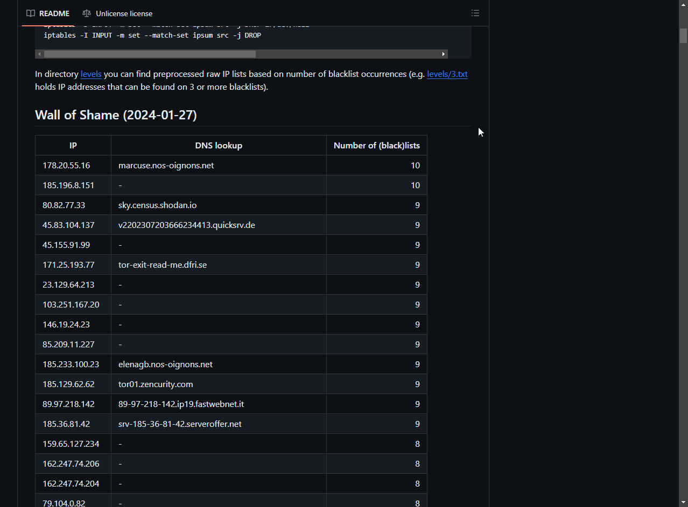

# IPinfo IP link Chrome Extension

## Convert IP addresses in websites to links using IPinfo

This Chrome extension goes through the DOM and replaces IPv4/IPv6 IPs with `ipinfo.io/{ip}` using regex. By clicking on an IP address, you will be redirected to the IPinfo page for that specific IP.

I made this extension in under an hour. However, there are some DOM loading issues that I am currently trying to resolve by simply *waiting it out*.